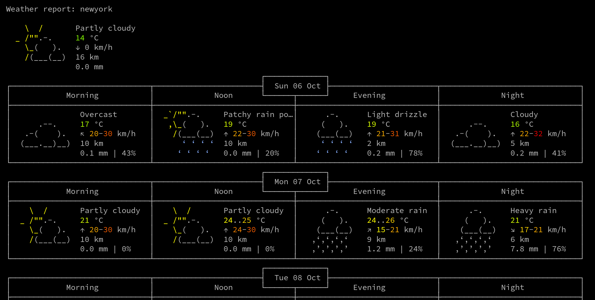

# WeaTher Forecast
This is very simple bash script. This will run in any linux environment including Termux.

## Installation
```
git clone https://github.com/technicaldada/weather
cd weather
chmod +x weather.sh
./weather.sh
```

## QuickLook

